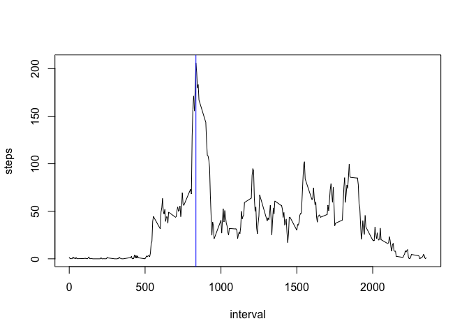

## Loading and preprocessing the data

Let's start by unzipping and loading the data.


```r
unzip("activity.zip")
data <- read.csv("activity.csv")
```

Let's now process/transform the data into a format suitable for our analysis. We'll use a more suitable data format for the date.


```r
library(dplyr)
library(lubridate)
options(scipen=6);

data <- data %>% mutate(date = ymd(date))
```

## What is mean total number of steps taken per day?
Let's make a histogram of the total number of steps taken each day.  We'll ignore the missing values from the dataset.  We'll also calculate the **mean** and **median** total number of steps taken per day and add them to the plot


```r
library(ggplot2)

dailyStats <- data %>% group_by(date) %>% summarise(steps = sum(steps, na.rm = TRUE))

mean <- mean(dailyStats$steps)
median <- median(dailyStats$steps)

g <- ggplot(dailyStats, aes(x=date, steps)) + 
  geom_histogram(stat="identity") + 
  geom_hline(aes(yintercept = median, linetype="Median"), col = "blue") +
  geom_hline(aes(yintercept = mean, linetype="Mean"), col = "blue") 

print(g)
```

<!-- -->

So, the mean is 9354 steps, and the median is 10395 steps.


## What is the average daily activity pattern?

Let's make a time series plot of the 5-minute interval (x-axis) and the average number of steps taken, averaged across all days (y-axis).  We'll also find which 5-minute interval, on average across all the days in the dataset, contains the maximum number of steps and add it to the plot.


```r
hourlyStats <- data %>% group_by(interval) %>% summarise(steps = mean(steps, na.rm = TRUE))
maxInterval <- as.numeric(hourlyStats[which.max(hourlyStats$steps),"interval"])

with(hourlyStats, plot(x = interval, y = steps, type="l"))
abline(v=maxInterval, col = "blue")
```

<!-- -->

So, the 5-minute interval that contains the maximum number of steps is 835


## Imputing missing values

Note that there are a number of days/intervals where there are missing values (coded as `NA`). The presence of missing days may introduce
bias into some calculations or summaries of the data.

So, we'll calculate and report the total number of missing values in the dataset.


```r
numberMissing <- sum(is.na(data$steps))
percentMissing <- mean(is.na(data$steps))
```

There are 2304 elements missing in the dataset, which represent roughly 13.11% of the dataset.

We'll create a new dataset and use the mean value across all days for missing 5-minute intervals.


```r
noNaData <- data %>% 
  group_by(interval) %>%
  mutate(steps = ifelse(is.na(steps), mean(steps, na.rm = TRUE), steps))

dailyStatsNoNa <- noNaData %>% group_by(date) %>% summarise(steps = sum(steps))

meanNoNa <- mean(dailyStatsNoNa$steps)
medianNoNa <- median(dailyStatsNoNa$steps)

g <- ggplot(dailyStatsNoNa, aes(x=date, steps)) + 
  geom_histogram(stat="identity") + 
  geom_hline(aes(yintercept = medianNoNa, linetype="Median"), col = "blue") +
  geom_hline(aes(yintercept = meanNoNa, linetype="Mean"), col = "blue") 

print(g)
```

<!-- -->

So, the mean without NA is 10766 steps, and the median without NA is 10766 steps.

|               | With NA             | Without NA              |
| ------------- |:-------------------:| -----------------------:|
| mean          | 9354   | 10766   |
| median        | 10395 | 10766 |

We see that these values differ from the first part of the assignment.  We also see that if we set the missing value equal to the mean of the corresponding 5-minute interval, the resulting mean & median are roughly equal.

## Are there differences in activity patterns between weekdays and weekends?

We'll analyse the data without NA.  We'll start by adding a column that specifies whether the day was a weekend or not.  We'll then calculate the mean for the week days and weekends and we'll plot everything.


```r
weekdayData <- noNaData %>%
  mutate(weekday = ifelse(wday(date) %in% c(1,7), "weekend", "week")) %>%
  group_by(date, weekday) %>% 
  summarise(steps = sum(steps, na.rm = TRUE))

weekMean <- mean(weekdayData[weekdayData$weekday=="week",]$steps,rm.na = TRUE)
weekendMean <- mean(weekdayData[weekdayData$weekday=="weekend",]$steps,rm.na = TRUE)

g <- ggplot(weekdayData, aes(x=date, y=steps)) + 
  facet_grid(weekday~.) +
  geom_line()

print(g)
```

<!-- -->

The mean on weekdays (10255.85) is smaller than on weekends (12201.52)
